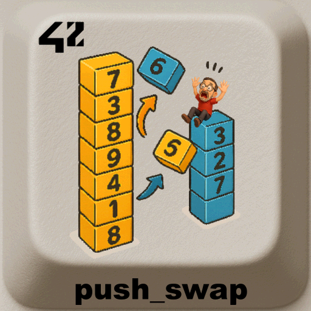

<div align="center">
  <h1>push_swap - 42 project</h1>
  
  <br>
</div>


> A sorting algorithm challenge using only **two stacks** and a very limited set of operations.  
> The goal is to sort a list of integers with **as few moves as possible** while respecting strict input/operations rules.

---

## 📖 Table of Contents
- [Description](#description)
- [Rules](#rules)
- [Operations](#operations)
- [Algorithm](#algorithm)
- [Complexity & Strategy](#complexity--strategy)
- [Installation](#%EF%B8%8F-installation)
- [Usage](#usage)
- [Examples](#examples)
- [Error Handling](#error-handling)
- [Project Structure](#project-structure)
- [Roadmap](#roadmap)
- [Credits](#credits)
- [License](#license)


---

## 📝 Description
`push_swap` takes a sequence of integers and sorts them in ascending order using two stacks: **A** (initial stack) and **B** (auxiliary stack).  
Only a restricted set of stack operations is allowed, and the objective is to minimize the number of operations.

---


## 📏 Rules
- Input is given as **space-separated** integers, via multiple arguments or a single quoted string.
- **No duplicates** allowed.
- All values must fit in a **32-bit signed int** (`[-2147483648, 2147483647]`).
- Non-numeric input or overflow must trigger an **Error** (printed to `stderr`).

---

## 🧰 Operations
All operations must be printed on `stdout`, one per line.

**Swap**
- `sa` — swap the first 2 elements of stack A  
- `sb` — swap the first 2 elements of stack B  
- `ss` — `sa` and `sb` at the same time

**Push**
- `pa` — push the top of B onto A  
- `pb` — push the top of A onto B

**Rotate (upwards)**
- `ra` — rotate A (first becomes last)  
- `rb` — rotate B (first becomes last)  
- `rr` — `ra` and `rb` at the same time

**Reverse rotate (downwards)**
- `rra` — reverse rotate A (last becomes first)  
- `rrb` — reverse rotate B (last becomes first)  
- `rrr` — `rra` and `rrb` at the same time

---

## 🧠 Algorithm
A typical approach that balances **simplicity** and **efficiency**:

1. **Parsing & Validation**
   - Split input, accept multiple spaces and/or a single quoted string.
   - Check numeric format, 32-bit range, and duplicates.

2. **Indexing / Normalization**
   - Map each value to its **rank** in the sorted order (0..n-1).  
     This reduces the value range, simplifies comparisons, and is required for radix.

3. **Small cases (hard-coded strategies)**
   - `n == 2`: `sa` if needed.
   - `n == 3`: minimal set of swaps/rotations (at most 3 operations).
   - `n <= 5`: push the smallest elements to B, sort 3 on A, then `pa` back with placement.

4. **Large cases**
   - **Radix sort (base 2)** on the indexed values:  
     For each bit from LSB to MSB:  
     - `pb` numbers with bit = 0, keep bit = 1 on A using `ra`  
     - `pa` everything back from B to A  
     Complexity ~ `O(n log n)` operations, extremely stable and simple.
   - **Chunking (optional/advanced)**: split indices into chunks, push to B by chunk with smart rotations, then reinsert greedily.  
     Can reduce move count vs. radix depending on implementation.

---

## 📈 Complexity & Strategy
- **Indexing**: `O(n log n)` (due to sorting to compute ranks).
- **Radix (binary)**: ~ `O(n * log2(max_index)))` ≈ `O(n log n)` operations.
- **Small cases**: constant-time decision trees.

> In practice: radix yields good scores quickly and is easy to debug.  
> Chunking can beat radix for mid/large `n` but is more complex.

---

## ⚙️ Installation
Requirements:  
- OS: Linux or macOS  
- C compiler (gcc/clang)  
- `make`

```bash
git clone https://github.com/LogUmi/push_swap.git
cd push_swap
make
```

This builds the `push_swap` executable.

---

## 🖥 Usage
Basic usage:
```bash
./push_swap 2 1 3 6 5 8
```

Single quoted string:
```bash
./push_swap "2 1 3 6 5 8"
```

Piping into a **checker** (if you have one locally or from the subject tooling):
```bash
./push_swap 2 1 3 6 5 8 | ./checker 2 1 3 6 5 8
# Output: OK (sorted) or KO
```

Counting operations:
```bash
./push_swap "$(< numbers.txt)" | wc -l
```

---

## 🔎 Examples
```bash
$ ./push_swap 3 2 1
sa
rra

$ ./push_swap "4 67 3 87 23"
pb
ra
pb
...

# With checker (your implementation may vary)
$ ARG="4 67 3 87 23"; ./push_swap $ARG | ./checker $ARG
OK
```

---

## ❗️ Error Handling
The program do **write "Error\n" to stderr** and exit with a non-zero status when:
- Non-numeric input (e.g. "12a", "+-3").
- Duplicates are present.
- Out-of-range values (not in 32-bit signed int).
- Memory allocation failure.

Suggested behaviors:
- Ignore extra spaces and **multiple spaces** between numbers.
- Accept leading `+`/`-` signs.
- Reject empty strings or arguments that reduce to nothing after trimming.

---

## 📂 Project Structure

```
.
├── bin/                # Content for README
├── includes/           # Header files (.h)
├── libft/				# Authorized functions
├── srcs/               # Source code (.c)
├── checker_linux		# push_swap checker for linux
├── checker_mac			# push_swap checker for mac os
├── fr.subject.pdf	    # Project 42 subject
├── LICENSE			    # License MIT
├── Makefile
└── README.md
```

---

## 🛠 Notes
- Use of the `libft` for utilities (atoi, list ops, etc.).
- Keep operations **printed exactly** as required; extra spaces or mixed cases are not allowed.
- Prefer **linked lists** or arrays—both are valid; just keep complexity minimal for operations.

---

## 🚀 Roadmap
- [x] Minimal ops for 3 and 5 elements
- [x] Radix sort (indexed values)
- [ ] Optional: chunk strategy with smart rotations
- [ ] Optional: `checker` program with visualizer hooks
- [ ] Unit tests and random input fuzzing

---

## 👤 Credits
Project developed by **Loïc Gérard** – 📧 Contact: lgerard@studend.42perpignan.fr - [École 42 Perpignan](https://42perpignan.fr).

---

## 📜 License
This project is licensed under the MIT License. You are free to use, modify, and distribute it - see the [LICENSE](./LICENSE) file for details.

> ⚠️ **Note for students**  
> If you are a student at 42 (or elsewhere), it is strongly recommended **not to copy/paste** this code.  
> Instead, try to **write your own solution** — it’s the only way to really learn and succeed.